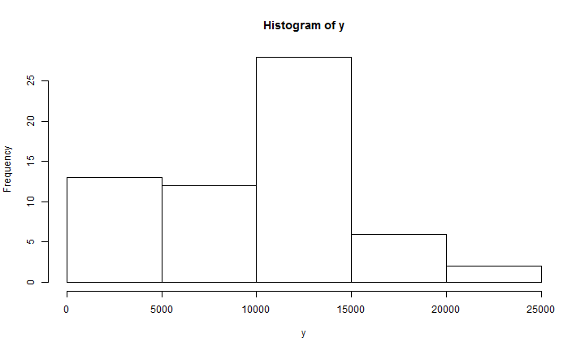
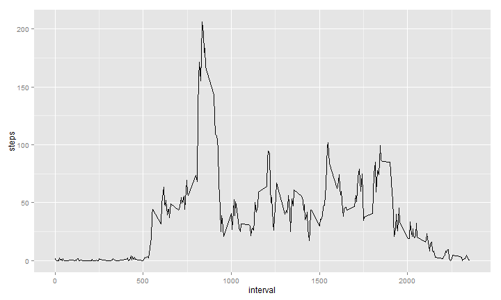
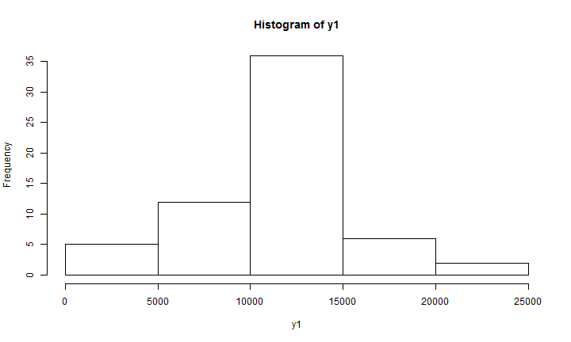
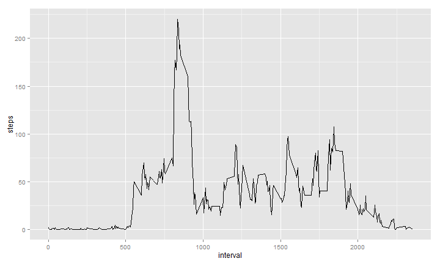
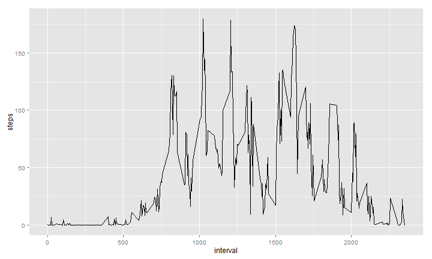

##Reproducible Research
====================================

#Peer Assessment 1

This assignment report consist of five parts

Part 1: Loading and preprocessing the data

```r
a<-read.csv("C:/Users/salahelding/Documents/R/repdata-data-activity/activity.csv")
```

Part2: Mean total number of steps taken per day


```r
y<-numeric()
x<-numeric()
z<-numeric()
a$date<-as.POSIXlt(a$date)

d<-max(a$date)-min(a$date)+1
a$date<-as.character(a$date)
r<-split(a,a$date)
i<-1
while (i <= d) {
        
        g<-r[[i]]
        
        y<-rbind(y,sum(g$steps, na.rm=TRUE))
        
        i<-i+1
}
```
The following is histogram showing the total number of steps taken each day

```r
hist(y)
```

 
The mean number of steps taken per day


```r
mean(y)
```

```
## [1] 9354
```
The median of number of steps taken per day

```r
median(y)
```

```
## [1] 10395
```

Part3: Average daily activity pattern?

```r
timelist<-unique(a$interval)
tab<-data.frame()
for (t in timelist) {
        sub<-subset(a,a$interval==t)    
        
        tab<-rbind(tab, mean(sub$steps, na.rm=TRUE))
}
dat<-data.frame(timelist,tab)
colnames(dat)<-c("interval", "steps")
```
Below is a time series plot of the 5-minute interval (x-axis) and the average number of steps taken, averaged across all days (y-axis)


```r
library(ggplot2)
ggplot(dat, aes(interval,steps)) + geom_line()
```

 

The five minutes that contains the maximum number of steps

```r
with(dat,dat$interval[dat$steps==max(dat$steps)])
```

```
## [1] 835
```

Part 4: Imputing missing values

The total number of missing values in the dataset 

```r
length(a[is.na(a)==TRUE, "steps"])
```

```
## [1] 2304
```

The best strategy to fill missing values without creating bias in the data is by calculating the average steps in the corresponding 5 minutes in all other days

The new data set after filling missing values using the above strategy

```r
q<-1
a1<-a
n<-nrow(a1)
while (q <= n ) {
        
        if (is.na(a1[q,"steps"])==TRUE) {
                
                a1[q,"steps"]<-dat[which(dat$interval==a1[q,"interval"]), "steps" ]
        }
       q<-q+1
}

head(a1)
```

```
##     steps       date interval
## 1 1.71698 2012-10-01        0
## 2 0.33962 2012-10-01        5
## 3 0.13208 2012-10-01       10
## 4 0.15094 2012-10-01       15
## 5 0.07547 2012-10-01       20
## 6 2.09434 2012-10-01       25
```

Histogram that shows the total steps taken per day after filling missing values

```r
y1<-numeric()
x1<-numeric()
z1<-numeric()
a1$date<-as.POSIXlt(a1$date)


d1<-max(a1$date)-min(a1$date)+1
a1$date<-as.character(a1$date)
r1<-split(a1,a1$date)
i1<-1
while (i1 <= d) {
        
        g1<-r1[[i1]]
        
        y1<-rbind(y1,sum(g1$steps))
        
        i1<-i1+1
}
hist(y1)
```

 
 Mean after filling missing values
 

```r
mean(y1)
```

```
## [1] 10766
```

Median after filling missing values

```r
median(y1)
```

```
## [1] 10766
```

Part 5 Differences in activity patterns between weekdays and weekends
Adding a new factor to the data that shows whether it is a weekend or weekday


```r
a2<-a1
week<-weekdays(as.Date(a2$date))
a2<-cbind(a2,week)
a2$week<-as.character(a2$week)
l<-1
while (l <= n) {
        
        ##a2$week<-switch(a2$week[l], "Monday"="Weekday", "Tuesday"="Weekday","Wednesday"="Weekday","Thursday"="Weekday","Friday"="Weekday","Saturday"="Weekend","Sunday"="Weekend")
        if (a2$week[l]=="Saturday") { a2$week[l]<-"Weekend"} 
        if (a2$week[l]=="Sunday") { a2$week[l]<-"Weekend"} 
        else { a2$week[l]<- "Weekday"}
        l<-l+1

}
a3<-split(a2,a2$week)
weekday<-a3[[1]]
weekend<-a3[[2]]

timelist1<-unique(weekday$interval)
tab1<-data.frame()
for (t1 in timelist1) {
        sub1<-subset(weekday,weekday$interval==t1)    
        
        tab1<-rbind(tab1, mean(sub1$steps, na.rm=TRUE))
}
dat1<-data.frame(timelist1,tab1)
colnames(dat1)<-c("interval", "steps")

head (dat1)
```

```
##   interval   steps
## 1        0 1.94375
## 2        5 0.38448
## 3       10 0.14952
## 4       15 0.17088
## 5       20 0.08544
## 6       25 1.38982
```

```r
timelist2<-unique(weekend$interval)
tab2<-data.frame()
for (t2 in timelist2) {
        sub2<-subset(weekend,weekend$interval==t2)    
        
        tab2<-rbind(tab2, mean(sub2$steps, na.rm=TRUE))
}
dat2<-data.frame(timelist2,tab2)
colnames(dat2)<-c("interval", "steps")

head (dat2)
```

```
##   interval    steps
## 1        0 0.214623
## 2        5 0.042453
## 3       10 0.016509
## 4       15 0.018868
## 5       20 0.009434
## 6       25 6.761792
```

Time series plot that shows the difference between weekdays and weekends
Weekdays

```r
ggplot(dat1, aes(interval,steps)) + geom_line()
```

 

Weekends

```r
ggplot(dat2, aes(interval,steps)) + geom_line()
```

 

##Thank You


