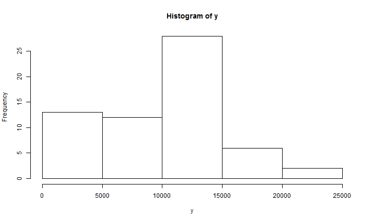
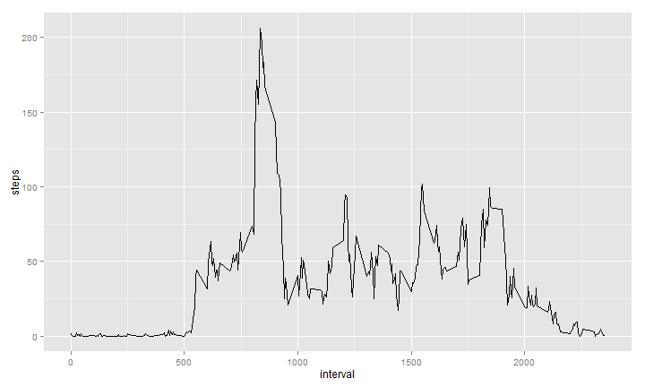
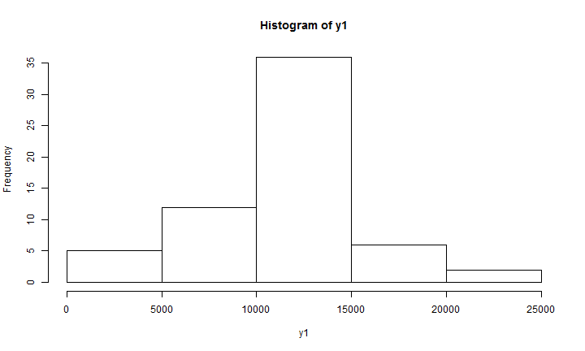
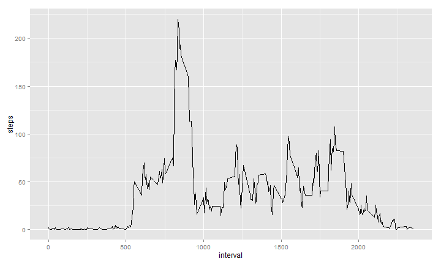
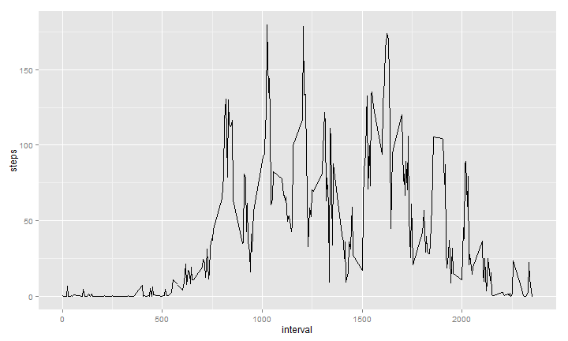

##Reproducible Research
====================================

#Peer Assessment 1

This assignment report consist of five parts

Part 1: Loading and preprocessing the data

```r
a <- read.csv("C:/Users/salahelding/Documents/R/repdata-data-activity/activity.csv")
```

Part2: Mean total number of steps taken per day


```r
y <- numeric()
x <- numeric()
z <- numeric()
a$date <- as.POSIXlt(a$date)

d <- max(a$date) - min(a$date) + 1
a$date <- as.character(a$date)
r <- split(a, a$date)
i <- 1
while (i <= d) {
    
    g <- r[[i]]
    
    y <- rbind(y, sum(g$steps, na.rm = TRUE))
    
    i <- i + 1
}
```
The following is histogram showing the total number of steps taken each day

```r
hist(y)
```


The mean number of steps taken per day


```r
mean(y)
```

```
[1] 9354
```
The median of number of steps taken per day

```r
median(y)
```

```
[1] 10395
```

Part3: Average daily activity pattern?

```r
timelist <- unique(a$interval)
tab <- data.frame()
for (t in timelist) {
    sub <- subset(a, a$interval == t)
    
    tab <- rbind(tab, mean(sub$steps, na.rm = TRUE))
}
dat <- data.frame(timelist, tab)
colnames(dat) <- c("interval", "steps")
```
Below is a time series plot of the 5-minute interval (x-axis) and the average number of steps taken, averaged across all days (y-axis)


```r
library(ggplot2)
ggplot(dat, aes(interval, steps)) + geom_line()
```



The five minutes that contains the maximum number of steps

```r
with(dat, dat$interval[dat$steps == max(dat$steps)])
```

```
[1] 835
```

Part 4: Imputing missing values

The total number of missing values in the dataset 

```r
length(a[is.na(a) == TRUE, "steps"])
```

```
[1] 2304
```

The best strategy to fill missing values without creating bias in the data is by calculating the average steps in the corresponding 5 minutes in all other days

The new data set after filling missing values using the above strategy

```r
q <- 1
a1 <- a
n <- nrow(a1)
while (q <= n) {
    
    if (is.na(a1[q, "steps"]) == TRUE) {
        
        a1[q, "steps"] <- dat[which(dat$interval == a1[q, "interval"]), "steps"]
    }
    q <- q + 1
}

head(a1)
```

```
    steps       date interval
1 1.71698 2012-10-01        0
2 0.33962 2012-10-01        5
3 0.13208 2012-10-01       10
4 0.15094 2012-10-01       15
5 0.07547 2012-10-01       20
6 2.09434 2012-10-01       25
```

Histogram that shows the total steps taken per day after filling missing values

```r
y1 <- numeric()
x1 <- numeric()
z1 <- numeric()
a1$date <- as.POSIXlt(a1$date)


d1 <- max(a1$date) - min(a1$date) + 1
a1$date <- as.character(a1$date)
r1 <- split(a1, a1$date)
i1 <- 1
while (i1 <= d) {
    
    g1 <- r1[[i1]]
    
    y1 <- rbind(y1, sum(g1$steps))
    
    i1 <- i1 + 1
}
hist(y1)
```


 Mean after filling missing values
 

```r
mean(y1)
```

```
[1] 10766
```

Median after filling missing values

```r
median(y1)
```

```
[1] 10766
```

Part 5 Differences in activity patterns between weekdays and weekends
Adding a new factor to the data that shows whether it is a weekend or weekday


```r
a2 <- a1
week <- weekdays(as.Date(a2$date))
a2 <- cbind(a2, week)
a2$week <- as.character(a2$week)
l <- 1
while (l <= n) {
    
    ## a2$week<-switch(a2$week[l], 'Monday'='Weekday',
    ## 'Tuesday'='Weekday','Wednesday'='Weekday','Thursday'='Weekday','Friday'='Weekday','Saturday'='Weekend','Sunday'='Weekend')
    if (a2$week[l] == "Saturday") {
        a2$week[l] <- "Weekend"
    }
    if (a2$week[l] == "Sunday") {
        a2$week[l] <- "Weekend"
    } else {
        a2$week[l] <- "Weekday"
    }
    l <- l + 1
    
}
a3 <- split(a2, a2$week)
weekday <- a3[[1]]
weekend <- a3[[2]]

timelist1 <- unique(weekday$interval)
tab1 <- data.frame()
for (t1 in timelist1) {
    sub1 <- subset(weekday, weekday$interval == t1)
    
    tab1 <- rbind(tab1, mean(sub1$steps, na.rm = TRUE))
}
dat1 <- data.frame(timelist1, tab1)
colnames(dat1) <- c("interval", "steps")

head(dat1)
```

```
  interval   steps
1        0 1.94375
2        5 0.38448
3       10 0.14952
4       15 0.17088
5       20 0.08544
6       25 1.38982
```

```r
timelist2 <- unique(weekend$interval)
tab2 <- data.frame()
for (t2 in timelist2) {
    sub2 <- subset(weekend, weekend$interval == t2)
    
    tab2 <- rbind(tab2, mean(sub2$steps, na.rm = TRUE))
}
dat2 <- data.frame(timelist2, tab2)
colnames(dat2) <- c("interval", "steps")

head(dat2)
```

```
  interval    steps
1        0 0.214623
2        5 0.042453
3       10 0.016509
4       15 0.018868
5       20 0.009434
6       25 6.761792
```

Time series plot that shows the difference between weekdays and weekends
Weekdays

```r
ggplot(dat1, aes(interval, steps)) + geom_line()
```



Weekends

```r
ggplot(dat2, aes(interval, steps)) + geom_line()
```



##Thank You


